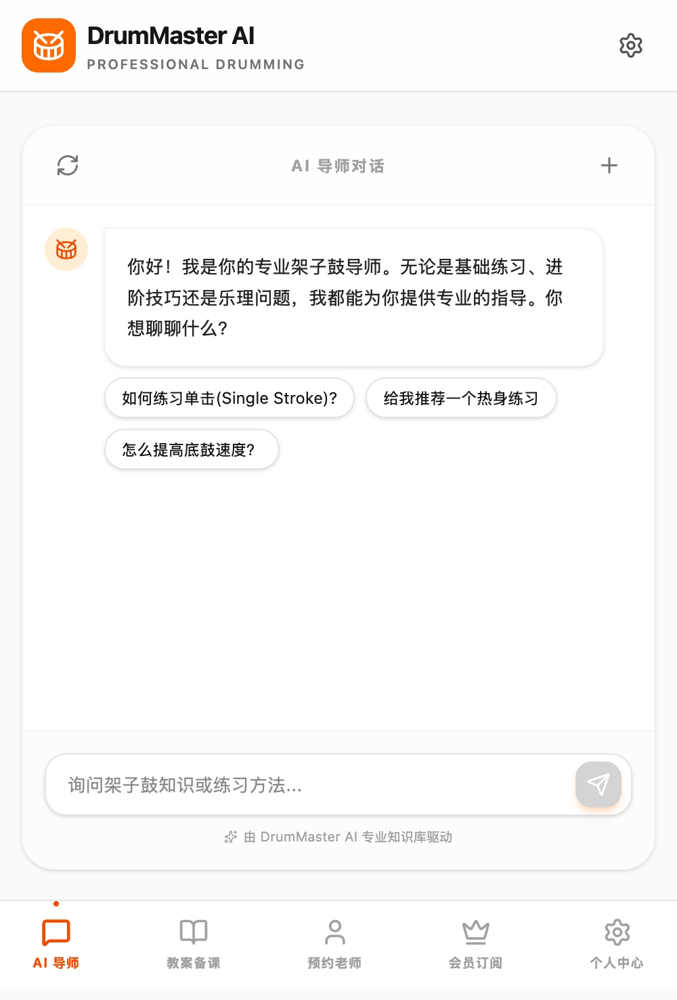
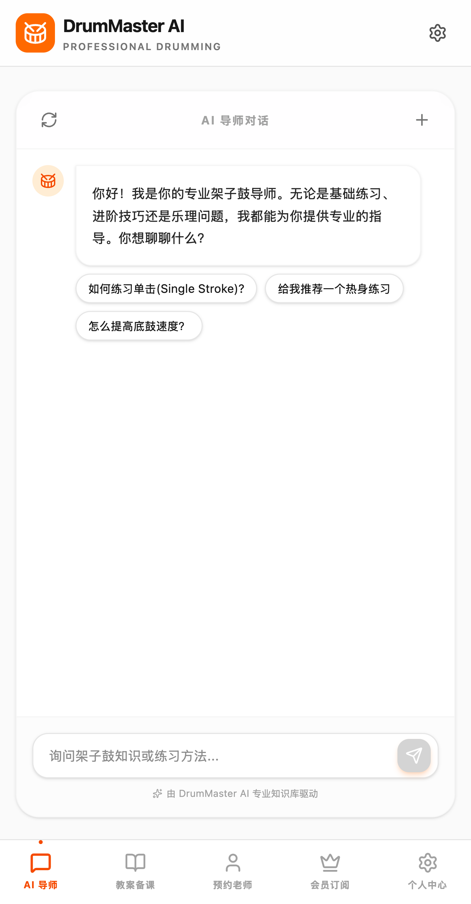
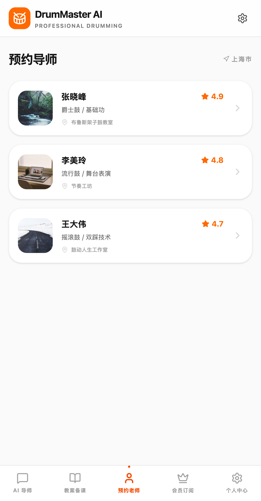
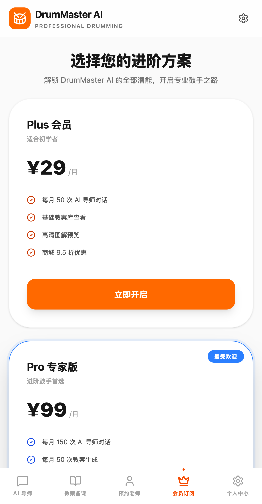

<div align="center">

# 🥁 DrumMaster AI

**专业架子鼓教学与备课助手 —— AI 智能问答 · 教案生成 · 一键图解**


</div>

---

DrumMaster AI 是一款面向架子鼓学生与教师的移动端优先 Web 应用。内置「20 年教学经验」人设的 AI 导师，随时解答乐理与技巧问题；输入主题和学生程度即可一键生成结构化教学教案并导出 PDF；同时提供教师预约与会员订阅等完整的产品化体验。

## ✨ 界面预览

| AI 导师对话 | 智能教案生成 |
| :---: | :---: |
|  |  |
| **预约导师** | **会员订阅** |
|  |  |

## 🧠 核心功能

### 🤖 AI 导师

- 与「专业架子鼓导师」人设的 Gemini AI 实时对话，覆盖基础练习、进阶技巧、乐理知识
- 内置高频问题快捷入口：单击（Single Stroke）练习、热身方案、底鼓提速……
- 支持多会话管理，历史对话本地持久化
- 涉及手型、握法、节奏型等回答可**一键生成 AI 教学图解**（Gemini 图像生成）

### 📝 智能教案备课

- 输入课程主题 + 学生程度（初级 / 中级 / 高级），自动生成结构化教案
- 教案包含：教学目标、重难点、教学步骤、课后作业，支持 Markdown 渲染预览
- 自动生成配套教学示意图，辅助课堂演示
- **一键导出 PDF**，备课历史本地保存，随时回看

### 📅 预约导师（演示）

- 导师卡片展示评分、专长方向、工作室地址
- 内置模拟预约流程与地图导航入口

### 👑 会员订阅（演示）

- Plus 会员订阅方案与权益展示，模拟支付流程

## 🛠 技术栈

| 层级 | 技术 |
| --- | --- |
| 前端框架 | React 19 + TypeScript + Vite 6 |
| UI / 样式 | Tailwind CSS 4、lucide-react、Motion（Framer Motion）动画 |
| AI 对话 / 教案 | Google Gemini（`@google/genai` SDK，中文系统指令人设） |
| AI 图解生成 | Gemini 图像生成模型，返回 base64 内嵌展示 |
| 文档导出 | react-markdown + html2pdf.js（html2canvas + jsPDF） |

> 项目为纯前端 SPA，数据持久化使用浏览器 localStorage，开箱即用、无需自建后端。

## 🚀 快速开始

**前置要求**：Node.js 18+

```bash
# 1. 安装依赖
npm install

# 2. 配置 Gemini API Key（在 https://aistudio.google.com 免费获取）
echo "GEMINI_API_KEY=你的Key" > .env.local

# 3. 启动开发服务器
npm run dev

# 4. 类型检查（可选）
npm run lint
```

访问 `http://localhost:3000` 即可使用。生产构建：`npm run build`。

> ⚠️ **安全提示**：API Key 通过 Vite 构建注入前端，适合本地开发与个人使用；公网部署请务必改走后端代理，避免 Key 泄露。

## 🗺 Roadmap

- [ ] 教师预约接入真实数据与支付
- [ ] 节拍器 / 跟练工具内置
- [ ] 学生练习打卡与进度追踪

---

<div align="center">

**DrumMaster AI** · Built with React & Gemini

</div>
